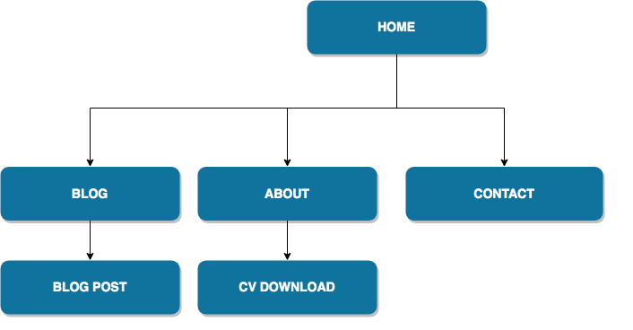
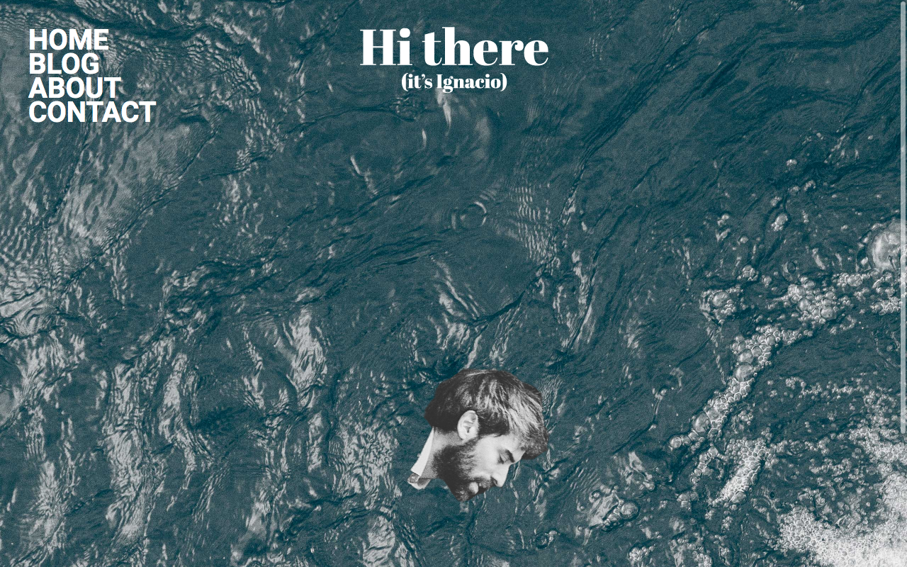
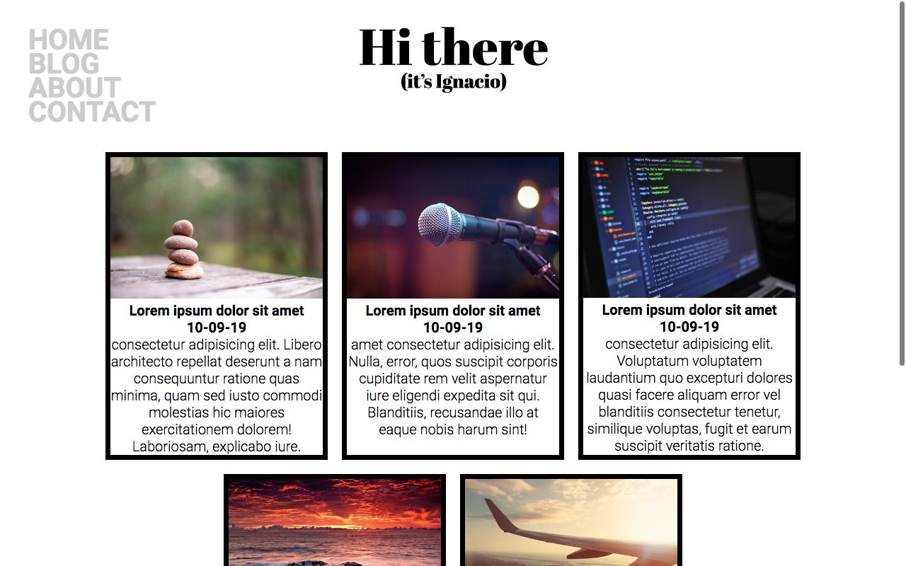
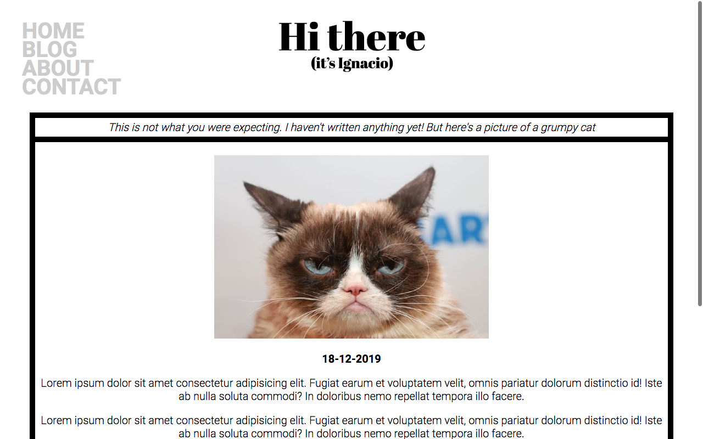
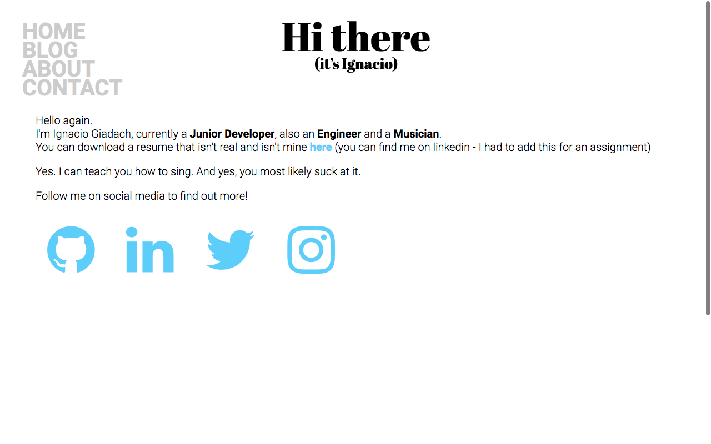
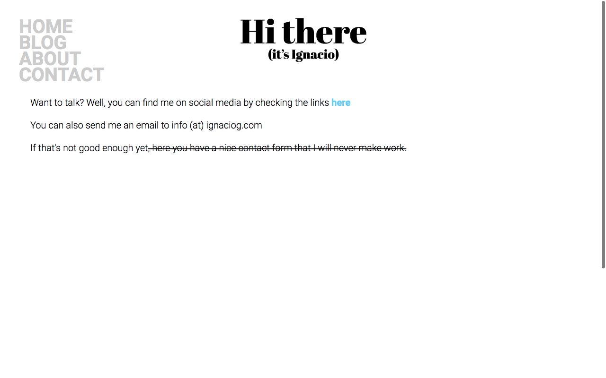

# Portfolio Documentation
## URL:
### https://igscl.github.io/
## Repository:
### https://github.com/igscl/igscl.github.io

## Description:

Portfolio website using HTML and SCSS. 

### Purpose:
The purpose of my website is to reflect a little bit of who I am while giving all the information needed to get in touch with me, providing a simple and minimalistic interface.

### Functionality / features

The website features 4 main pages and 1 sub-page.

- Spinning image at homepage
- Parallax effect on homepage
- Responsive menu across all the pages
- CSS hover effects
- CSS text animation at home's footer
- Responsive blog page with image styling with CSS
- Social icons from Font Awesome
- Links to social media
- Sub-resource integrity with SHA-384

Also used flexbox, media queries and Google Fonts.

## Sitemap

## Screenshots

### Home

### Blog

### Blog Article

### About

### Contact

## Target Audience

Anyone who is interested in what I do, potentially for employment purposes.

## Tech Stack

I used the following:

- Balsamiq
- HTML5
- SASS
- Git
- Github
- Digital Ocean VPS